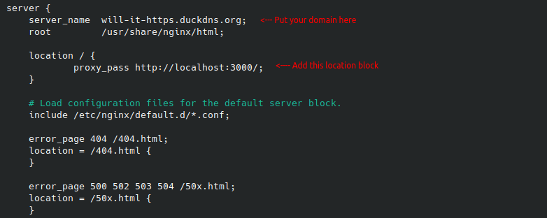

 
 # Setting Up an Amazon EC2 Instance Test Environment
 
 ## Setup AWS EC2
 - [ ] Setup an Amazon AWS Account at https://aws.amazon.com/
 - [ ] Navigate to the EC2 service under Compute
    - [ ] Select the waffle at the top left of the page
    - [ ] Select "Compute"
    - [ ] Select "EC2"
 - [ ] Select "Launch Instance" from the EC2 Dashboard
 - [ ] Inside the "Application and OS Images" section
    - [ ] In the "Amazon Machine Image" dropdown, select "Amazon Linux 2 AMI (HVM) - Kernel 5.10..."
 - [ ] Inside the "Instance Type" section
    - [ ] In the dropdown, select "t2.micro"
 - [ ] Inside the "Network Setting" section
    - [ ] Make sure that "Allow SSH traffic from" is checked
    - [ ] Make sure "Anywhere" is selected in the dropdown next to this checkbox
    - [ ] Make sure "Allow HTTPS traffic from the internet" is checked
    
 - [ ] Inside the "Key pair (login)" section
     - [ ] Select "Create new key pair"
     - [ ] Enter a key pair name
     - [ ] Leave the pair type on "RSA" and the file format on ".pem"
     - [ ] Select "Create key pair"
     - [ ] You should have automatically downloaded a copy of the key file. Save this in a convenient location (not the repo, please).
     - [ ] Verify your key pair is selected in the dropdown.

 - [ ] In the "Configure storage" section
     - [ ] Set the root volume to 8 GiB with a general purpose SSD (gp2).
     
 - [ ] Select "Launch instance" on the right.
 - [ ] Select "View all instances"
 - [ ] You should see an instance listed. When it says "Running", select the instance.
 - [ ] Go to the "Security" tab
    - [ ] Select the link under "Security groups"
    - [ ] Verify an inbound rule is present for "SSH" via "TCP" and on port 22 (the default port for SSH connections).
    - [ ] Verify an inbound rule is present for "HTTPS" via "TCP" and on port 443 (the default port for HTTPS connections).
 - [ ] Return to your Instance summary (Instances on the left menu, then select the instance). You will need information from this page for connecting to your server with SSH.

 ## Connecting to your AWS EC2 instance
 - [ ] Open a terminal from the directory containing your key-pair file
 - [ ] Run the following command: chmod 400 yourkey.pem
 - [ ] Enter the following command: ssh -i "yourkey.pem" ec2-user@<public IPv4 address for your instance>
 
 ## Setting up your server
 ### Make sure your software is up to date
 - [ ] Run the following command: sudo yum update
 ### Install Java
 - [ ] Run the following command: sudo yum install java-17-amazon-corretto
 ### Install Gradle
 - [ ] Get the files with the following command: wget https://services.gradle.org/distributions/gradle-7.4.2-bin.zip
 - [ ] Unzip the file with the following command: unzip gradle-7.4.2-bin.zip
 - [ ] Move the file to the correct directory with the following command: sudo mv gradle-7.4.2 /opt/
 - [ ] Remove the zip file with the following command: rm gradle-7.4.2-bin.zip
 - [ ] Open the file with the following command: sudo nano /etc/profile.d/gradle.sh
 - [ ] Copy the following lines into the file:
    - export GRADLE_HOME=/opt/gradle-7.4.2
    - export PATH=${GRADLE_HOME}/bin:${PATH}
 - [ ] Save and close the file
 ### Install Git and download the server repo
 - [ ] Install Git with the following command: sudo yum install git
 - [ ] Clone our "Push-2-Talk-Server" repo here.
 ### Start the setup of duckdns
 - [ ] Go to duckdns.org and login
 - [ ] Enter an available domain name and select "add domain".
 - [ ] Your new domain will appear in the list beneath. Add the public IPv4 address for your EC2 instance into the "current ip" field. Select "update ip".
 - [ ] Select "install" from the top navigation bar.
 - [ ] Verify "linux cron" is selected.
 - [ ] Select the domain you created in the drop down.
 ### Install and setup nginx
 - [ ] Install nginx with the following command: sudo amazon-linux-extras install nginx1 ("y" when prompted)
 - [ ] Edit the nginx config file with the following command: sudo nano /etc/nginx/nginx.conf
    - [ ] Make it look like the following inside the "server" block:
    
 - [ ] Start nginx with the following command: sudo nginx -s reload
    - [ ] You may need the following command go get nginx running: sudo systemct1 start nginx.service
 ### Finish setup of duckdns
 - [ ] Go back the webpage for setting up duckdns linux cron. Follow the instructions. If you do not want to figure out how to use vim, you can replace "vim" with "nano" in their commands.
 ### Setup HTTPS certificates
 - [ ] Run the following command: sudo amazon-linux-extras install epel
 - [ ] Run the following command: sudo yum install -y python2-certbot-nginx
 - [ ] Run the following command: sudo certbot
 - [ ] When prompted, type "y".
 - [ ] When prompted, enter an email address (you don't really have to).
 - [ ] When prompted, type "a" to agree.
 - [ ] When prompted, type "n" if you do not want to receive emails.
 - [ ] When prompted, type the number associated with your domain from the list.
 - [ ] When prompted, type "2" to configure a redirect.
 
 ## Setup Push 2 Talk
 - [ ] Go to the repo directory.
 - [ ] Run the following command to install node: nvm install 12
 - [ ] Run the following command to install the modules: npm install 
 - [ ] Run the following command from within the src folder to start the Push 2 Talk server: node server.js
 - [ ] You should not be able to visit your server through your domain in a web browser (it will say "Server running").
 
 ## Point your Push 2 Talk client at the new server
 - [ ] On your main machine running the Push 2 Talk application, go to the "VoiceHelper" class.
 - [ ] Change "https://www.auxiliumgroup.com:8999/" to your new domain. Include "https://". For example: "https://will-it-https.duckdns.org/".
 - [ ] Run the application and verify it works.
